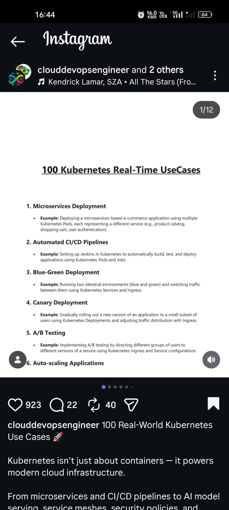
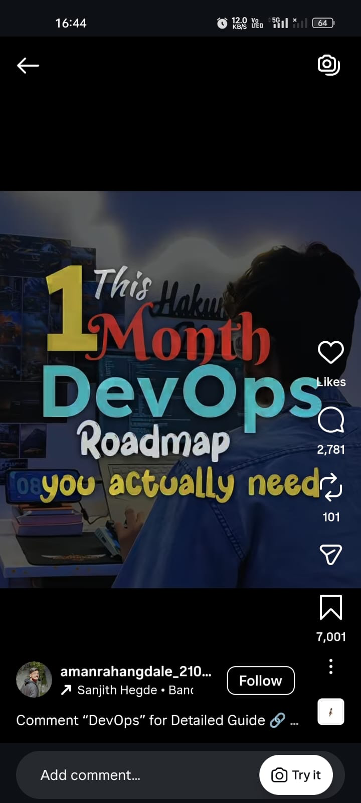
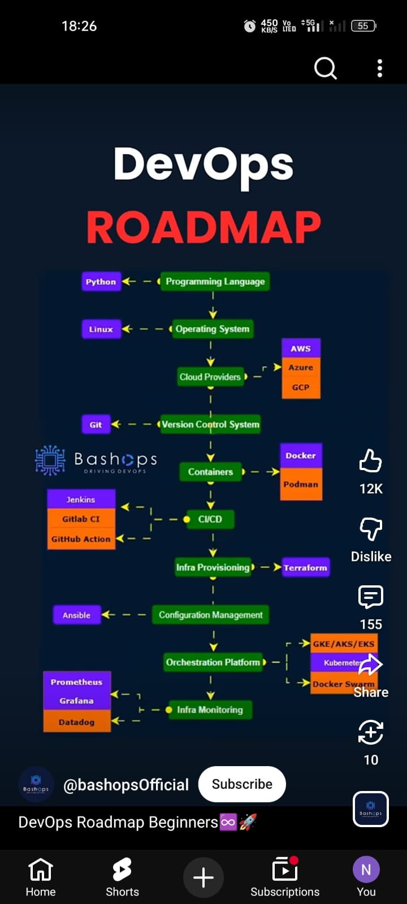

# Social Content Extractor

A CLI tool that turns public Instagram posts, Instagram reels, and YouTube Shorts into reusable text for notes, docs, and LLM workflows.

It helps you:

- download media from public Instagram posts and reels
- download media from public YouTube Shorts
- extract captions, hashtags, mentions, and visible on-screen text
- OCR carousel slides and short-form video scenes automatically
- save everything in a clean folder structure
- prepare extracted content for notes, docs, or LLM workflows

## Use Case

If you've ever tried to turn useful Instagram content into notes, docs, or LLM-ready context, you already know the pain.

One image is manageable. You can take a screenshot, run OCR, and copy the text.

But the process gets annoying very quickly when:

- the useful content is spread across a 10-slide or 20-slide carousel
- the real content is inside a reel and you have to pause frame by frame
- the caption contains part of the message and the media contains the rest

The manual workflow usually looks like this:

- take screenshots one by one
- open Google Lens or another OCR tool
- copy the text manually
- repeat for every slide or frame

That is exactly the repetitive work this tool removes.

You give it an Instagram post, Instagram reel, or YouTube Shorts URL, and it handles the rest:

- downloads the media for you
- extracts visible text from slides or reel scenes
- captures caption, hashtags, and mentions
- saves everything into structured output files you can reuse in notes, docs, or downstream workflows

In short: give it a URL, and it gives you the content back in a usable form.

## Quick Start

## First Run

Clone the repo:

```bash
git clone git@github.com:shaikahmadnawaz/social-content-extractor.git
cd social-content-extractor
```

Create and activate a virtual environment:

```bash
python3 -m venv .venv
source .venv/bin/activate
python -m ensurepip --upgrade
```

Install the package:

```bash
python -m pip install -e .
```

Install local OCR/video dependencies:

```bash
brew install tesseract
brew install ffmpeg
```

Verify the CLI:

```bash
social-content-extractor --help
```

Run your first extraction:

```bash
social-content-extractor "https://www.instagram.com/p/DVqbs3Qjifn/" --sarvam
```

Install dependencies:

```bash
pip install -e .
brew install tesseract
brew install ffmpeg
```

If you prefer not to install the package in editable mode, use:

```bash
PYTHONPATH=src python -m social_content_extractor --help
```

Run it on a post:

```bash
social-content-extractor "https://www.instagram.com/p/DVqbs3Qjifn" --sarvam
```

Run it on a reel:

```bash
social-content-extractor "https://www.instagram.com/reel/DTTBJSgE6pP" --sarvam
```

Run it on a YouTube Short:

```bash
social-content-extractor "https://www.youtube.com/shorts/Lay3pQF3I3c" --sarvam
```

Output will be saved under:

```text
downloads/instagram/posts/<shortcode>/
downloads/instagram/reels/<shortcode>/
downloads/youtube/shorts/<video_id>/
```

If you want pure local OCR only:

```bash
social-content-extractor "https://www.instagram.com/p/DVqbs3Qjifn" --local
social-content-extractor "https://www.instagram.com/reel/DTTBJSgE6pP" --local
social-content-extractor "https://www.youtube.com/shorts/Lay3pQF3I3c" --local
```

## Project Structure

The project now keeps the application code under `src/social_content_extractor/`:

```text
src/social_content_extractor/
  __init__.py
  __main__.py
  cli.py
  extractor/
    __init__.py
    constants.py
    core.py
    sources.py
    text.py
```

## Which Mode Should You Use?

If you just want the safest starting point, use these commands:

```bash
# Recommended default for posts/carousels
social-content-extractor "https://www.instagram.com/p/DVqbs3Qjifn" --sarvam

# Recommended default for reels
social-content-extractor "https://www.instagram.com/reel/DTTBJSgE6pP" --sarvam

# Recommended default for YouTube Shorts
social-content-extractor "https://www.youtube.com/shorts/Lay3pQF3I3c" --sarvam
```

When to use each mode:

- `--local`: pure Tesseract OCR, no Sarvam involved anywhere
- `--sarvam`: local OCR plus Sarvam cleanup, best overall default
- `--sarvam-vision`: Sarvam Vision OCR plus Sarvam cleanup, useful mainly for comparing results on posts/carousels

Practical recommendation:

- for posts and carousels, start with `--sarvam`
- for reels, start with `--sarvam`
- for YouTube Shorts, start with `--sarvam`
- use `--local` when you want the simplest OCR path
- use `--sarvam-vision` mainly when you want to compare Vision OCR quality on posts

## Real Example Output

These are real example inputs and terminal outputs from actual runs of the tool.

The Instagram post output is shortened in the middle for readability because the full carousel OCR spans 12 slides. The reel and YouTube Short outputs are included as practical excerpts.

### Example post

Input:

<p>
  
</p>

Command:

```bash
social-content-extractor "https://www.instagram.com/p/DVqbs3Qjifn" --sarvam
```

Terminal output excerpt:

```text
Extracting content + running local OCR + Sarvam cleanup...
JSON Query to graphql/query: 403 Forbidden when accessing https://www.instagram.com/graphql/query [retrying; skip with ^C]
downloads/instagram/posts/DVqbs3Qjifn/media/DVqbs3Qjifn_1.jpg downloads/instagram/posts/DVqbs3Qjifn/media/DVqbs3Qjifn_2.jpg downloads/instagram/posts/DVqbs3Qjifn/media/DVqbs3Qjifn_3.jpg downloads/instagram/posts/DVqbs3Qjifn/media/DVqbs3Qjifn_4.jpg downloads/instagram/posts/DVqbs3Qjifn/media/DVqbs3Qjifn_5.jpg downloads/instagram/posts/DVqbs3Qjifn/media/DVqbs3Qjifn_6.jpg downloads/instagram/posts/DVqbs3Qjifn/media/DVqbs3Qjifn_7.jpg downloads/instagram/posts/DVqbs3Qjifn/media/DVqbs3Qjifn_8.jpg downloads/instagram/posts/DVqbs3Qjifn/media/DVqbs3Qjifn_9.jpg downloads/instagram/posts/DVqbs3Qjifn/media/DVqbs3Qjifn_10.jpg downloads/instagram/posts/DVqbs3Qjifn/media/DVqbs3Qjifn_11.jpg downloads/instagram/posts/DVqbs3Qjifn/media/DVqbs3Qjifn_12.jpg

╔══════════════════════════════════════════════════════════════════════════════╗
║ Social Content Extractor                                                     ║
║ https://www.instagram.com/p/DVqbs3Qjifn/                                     ║
╚══════════════════════════════════════════════════════════════════════════════╝
                     Post Info
╭───────────────────┬─────────────────────────────╮
│  Platform         │  Instagram                  │
│  Owner            │  @clouddevopsengineer       │
│  Type             │  CAROUSEL                   │
│  Date (UTC)       │  2026-03-09T12:04:08        │
│  Date (Local)     │  2026-03-09T17:34:08+05:30  │
│  Likes            │  926                        │
│  Comments         │  22                         │
│  Media Count      │  12                         │
╰───────────────────┴─────────────────────────────╯
╭─ Caption ────────────────────────────────────────────────────────────────────╮
│ 100 Real-World Kubernetes Use Cases 🚀                                       │
│                                                                              │
│ Kubernetes isn’t just about containers — it powers modern cloud              │
│ infrastructure.                                                              │
│                                                                              │
│ From microservices and CI/CD pipelines to AI model serving, service meshes,  │
│ security policies, and multi-cloud deployments, Kubernetes runs the backbone │
│ of today’s scalable systems.                                                 │
╰──────────────────────────────────────────────────────────────────────────────╯
             Media Summary
╭──────┬──────────┬────────────────────╮
│  #   │   Type   │ Saved As           │
├──────┼──────────┼────────────────────┤
│  1   │  IMAGE   │ DVqbs3Qjifn_1.jpg  │
│  2   │  IMAGE   │ DVqbs3Qjifn_2.jpg  │
│  3   │  IMAGE   │ DVqbs3Qjifn_3.jpg  │
│  4   │  IMAGE   │ DVqbs3Qjifn_4.jpg  │
│  5   │  IMAGE   │ DVqbs3Qjifn_5.jpg  │
│  6   │  IMAGE   │ DVqbs3Qjifn_6.jpg  │
│  7   │  IMAGE   │ DVqbs3Qjifn_7.jpg  │
│  8   │  IMAGE   │ DVqbs3Qjifn_8.jpg  │
│  9   │  IMAGE   │ DVqbs3Qjifn_9.jpg  │
│  10  │  IMAGE   │ DVqbs3Qjifn_10.jpg │
│  11  │  IMAGE   │ DVqbs3Qjifn_11.jpg │
│  12  │  IMAGE   │ DVqbs3Qjifn_12.jpg │
╰──────┴──────────┴────────────────────╯

╭─ Slide 1 - OCR Text (94.4%) ─────────────────────────────────────────────────╮
│ 100 Kubernetes Real-Time UseCases                                            │
│ 1. Microservices Deployment                                                  │
│ Example: Deploying a microservices-based e-commerce application using        │
│ multiple Kubernetes Pods, each representing a different service.             │
│ 2. Automated CI/CD Pipelines                                                 │
│ Example: Setting up Jenkins in Kubernetes to automatically build, test, and  │
│ deploy applications using Kubernetes Pods and Jobs.                          │
╰──────────────────────────────────────────────────────────────────────────────╯

... output for slides 2 through 11 omitted here for brevity ...

╭─ Slide 12 - OCR Text (94.0%) ────────────────────────────────────────────────╮
│ Example: Managing applications across on-premises and cloud environments     │
│ using Kubernetes federation and multi-cloud strategies.                      │
│ 97. Telemetry and Observability                                              │
│ Example: Implementing telemetry and observability using Prometheus, Grafana, │
│ and Jaeger in a Kubernetes environment.                                      │
│ 98. Data Replication                                                         │
│ Example: Implementing data replication across clusters for high availability │
│ and disaster recovery using Kubernetes tools and operators.                  │
│ 99. API Gateway Integration                                                  │
│ Example: Integrating an API Gateway like Kong or Ambassador with Kubernetes  │
│ for managing and securing microservices APIs.                                │
│ 100. Performance Optimization                                                │
│ Example: Optimizing application performance using Kubernetes resource        │
│ management, autoscaling, and monitoring tools.                               │
╰──────────────────────────────────────────────────────────────────────────────╯

Downloaded media: 12 file(s)
OCR text saved to:
downloads/instagram/posts/DVqbs3Qjifn/content/DVqbs3Qjifn.sarvam.ocr.txt
```

### Example reel

Input:

<p>
  
</p>

Command:

```bash
social-content-extractor "https://www.instagram.com/reel/DTTBJSgE6pP" --sarvam
```

Terminal output:

```text
Extracting content + running local OCR + Sarvam cleanup...
JSON Query to graphql/query: 403 Forbidden when accessing https://www.instagram.com/graphql/query [retrying; skip with ^C]
downloads/instagram/reels/DTTBJSgE6pP/media/DTTBJSgE6pP_1.mp4

╔══════════════════════════════════════════════════════════════════════════════╗
║ Social Content Extractor                                                     ║
║ https://www.instagram.com/reel/DTTBJSgE6pP/                                  ║
╚══════════════════════════════════════════════════════════════════════════════╝
                     Post Info
╭───────────────────┬─────────────────────────────╮
│  Platform         │  Instagram                  │
│  Owner            │  @amanrahangdale_2108       │
│  Type             │  VIDEO                      │
│  Date (UTC)       │  2026-01-09T16:48:26        │
│  Date (Local)     │  2026-01-09T22:18:26+05:30  │
│  Likes            │  -1                         │
│  Comments         │  2783                       │
│  Media Count      │  1                          │
╰───────────────────┴─────────────────────────────╯
╭─ Caption ────────────────────────────────────────────────────────────────────╮
│ Comment “DevOps” for Detailed Guide 🔗                                       │
│                                                                              │
│ 📱 Follow @amanrahangdale_2108 for more Free Courses, Tech Updates, and      │
│ Career Tips every week 💡                                                    │
╰──────────────────────────────────────────────────────────────────────────────╯
╭─ Mentions ───────────────────────────────────────────────────────────────────╮
│ @amanrahangdale_2108                                                         │
╰──────────────────────────────────────────────────────────────────────────────╯
             Media Summary
╭──────┬──────────┬───────────────────╮
│  #   │   Type   │ Saved As          │
├──────┼──────────┼───────────────────┤
│  1   │  VIDEO   │ DTTBJSgE6pP_1.mp4 │
╰──────┴──────────┴───────────────────╯

╭─ Slide 1 - Video OCR Scenes ─────────────────────────────────────────────────╮
│ 00:02                                                                        │
│ DevOps                                                                       │
│ Roadmap                                                                      │
│ you actually need                                                            │
│                                                                              │
│ 00:04                                                                        │
│ DevOps Roadmap                                                               │
│ DevOps Foundations                                                           │
│ (What you MUST know first)                                                   │
│ Linux:                                                                       │
│ files, permissions, processes, services                                      │
│ Networking:                                                                  │
│ HTTP/HTTPS, DNS, ports, SSH                                                  │
│ Scripting:                                                                   │
│ Bash (mandatory), Python (basic)                                             │
│ Version Control:                                                             │
│ Git, GitHub/GitLab                                                           │
│ Build Tools:                                                                 │
│ Maven/npm/pip                                                                │
│ Goal: Strong system + automation basics                                      │
│                                                                              │
│ 00:06                                                                        │
│ Core DevOps Tools                                                            │
│ (Heart of DevOps )                                                           │
│ CI/CD:                                                                       │
│ Jenkins / GitHub Actions                                                     │
│ Containers:                                                                  │
│ Docker, Dockerfile, Docker Compose                                           │
│ Orchestration:                                                               │
│ Kubernetes (Pods, Deployments, Services)                                     │
│ Cloud:                                                                       │
│ AWS (EC2, S3, IAM, EKS)                                                      │
│ laC: AN                                                                      │
│ Terraform (infra automation)                                                 │
│ Goal: Automate build > test > deploy > scale                                 │
│                                                                              │
│ 00:07                                                                        │
│ Advanced + Career                                                            │
│ (Production & Jobs                                                           │
│ Config Mgmt:                                                                 │
│ Ansible                                                                      │
│ Monitoring:                                                                  │
│ Prometheus, Grafana                                                          │
│ Logging:                                                                     │
│ ELK Stack                                                                    │
│ Security:                                                                    │
│ IAM, Secrets, Trivy, SonarQube                                               │
│ Practices:                                                                   │
│ DevSecOps, GitOps, Blue-Green Deploy                                         │
│ Projects:                                                                    │
│ CI/CD pipeline                                                               │
│ Docker + Kubernetes deployment                                               │
│ JY Cloud infra with Terraform                                                │
│ Roles: DevOps Engineer | Cloud Engineer | SRE                                │
╰──────────────────────────────────────────────────────────────────────────────╯

Downloaded media: 1 file(s)
OCR text saved to:
downloads/instagram/reels/DTTBJSgE6pP/content/DTTBJSgE6pP.sarvam.ocr.txt
```

### Example YouTube Short

Input:

<p>
  
</p>

Input URL:

```text
https://www.youtube.com/shorts/Lay3pQF3I3c
```

Command:

```bash
social-content-extractor "https://www.youtube.com/shorts/Lay3pQF3I3c" --sarvam
```

Terminal output excerpt:

```text
Extracting content + running local OCR + Sarvam cleanup...

╔══════════════════════════════════════════════════════════════════════════════╗
║ Social Content Extractor                                                     ║
║ https://www.youtube.com/shorts/Lay3pQF3I3c                                   ║
╚══════════════════════════════════════════════════════════════════════════════╝
                      Post Info
╭───────────────────┬────────────────────────────────╮
│  Platform         │  Youtube                       │
│  Owner            │  @bashopsOfficial              │
│  Title            │  DevOps Roadmap Beginners♾️🚀  │
│  Type             │  VIDEO                         │
│  Date (UTC)       │  2024-09-26T06:29:23+00:00     │
│  Likes            │  12205                         │
│  Comments         │  155                           │
│  Media Count      │  1                             │
╰───────────────────┴────────────────────────────────╯
╭─ Caption ────────────────────────────────────────────────────────────────────╮
│ DevOps Roadmap Beginners♾️🚀                                                 │
│                                                                              │
│ DevOps RoadMap,Learn DevOps from the scratch to advanced level.              │
╰──────────────────────────────────────────────────────────────────────────────╯
             Media Summary
╭──────┬──────────┬───────────────────╮
│  #   │   Type   │ Saved As          │
├──────┼──────────┼───────────────────┤
│  1   │  VIDEO   │ Lay3pQF3I3c_1.mp4 │
╰──────┴──────────┴───────────────────╯

╭─ Slide 1 - Video OCR Scenes ─────────────────────────────────────────────────╮
│ 00:00                                                                        │
│ Python < — - Programming Language                                            │
│ V                                                                            │
│ Linux <— — -  Operating System                                               │
│ AWS                                                                          │
│ v                                                                            │
│ Cloud Providers                                                              │
│ Git <— — Codtrol System                                                      │
│ “Docker                                                                      │
│ DRIVING DEVOPS Containers —                                                  │
│ Jenkins <- -                                                                 │
│ Gitiab CI — -@ CICD                                                          │
│ GitHub Action                                                                │
│                                                                              │
│ infra Provisioning» —> Terraform                                             │
│                                                                              │
│ Ansible < — — —- Configuration Management                                    │
│ Orchestration Platform — Kubernetes                                          │
│ Prometheus iq Docker Swarm                                                   │
│ Grafana 7 v                                                                  │
│ Infra Monitoring                                                             │
╰──────────────────────────────────────────────────────────────────────────────╯

Downloaded media: 1 file(s)
OCR text saved to:
downloads/youtube/shorts/Lay3pQF3I3c/content/Lay3pQF3I3c.sarvam.ocr.txt
```

## What You Get

After a run, you get:

- post metadata such as owner, type, timestamps, likes, and comments
- caption text
- hashtags and mentions
- downloaded media files
- OCR text for carousel slides or reel scenes
- structured JSON for downstream use
- Instagram accessibility caption when you explicitly request it

## How It Works

The extraction flow is:

1. Parse the input URL and detect the platform and media type.
2. Extract the platform-specific content ID.
3. Fetch metadata from the platform adapter:
   - Instagram uses `Instaloader`
   - YouTube Shorts uses `yt-dlp`
4. Download media into the platform-first output structure.
5. Reuse cached media if a valid copy already exists locally.
6. Optionally run OCR depending on the selected mode.
7. Save OCR and JSON artifacts into the item's `content/` folder.

## Content Source Handling

Short-form social content is not always text-on-image first.

Sometimes:

- the media is only representational and the real message is in the caption
- the caption is promotional and the real message is inside the slides or reel frames
- both sources matter

To handle that, the extractor does not merge caption and OCR blindly.

Instead, it keeps them separate and adds a lightweight decision layer:

- `content_strategy`
- `primary_source`
- `primary_text`

Current strategy values:

- `caption_only`
- `ocr_only`
- `caption_plus_ocr`
- `media_representational`
- `none`

How it behaves:

- if caption is substantial and OCR is weak, it prefers the caption
- if OCR is substantial and caption is weak or mostly promotional, it prefers OCR
- if both are meaningful, it keeps both and marks the result as `caption_plus_ocr`

This keeps the raw data intact while still giving you a practical default.

## Supported OCR Modes

### `--local`

Pure local OCR.

Behavior:

- uses `Tesseract` only
- does not use Sarvam anywhere
- best when you want the simplest OCR path

### `--sarvam`

Local OCR plus Sarvam cleanup.

Behavior:

- OCR is done locally with `Tesseract`
- text cleanup and sentence formatting are done with Sarvam chat
- this is currently the safest Sarvam-backed mode for reels and Shorts

### `--sarvam-vision`

Sarvam Vision OCR plus Sarvam cleanup.

Behavior:

- OCR is done by Sarvam Vision
- cleanup and sentence formatting are done with Sarvam chat
- useful for some posts and carousels
- currently less reliable for reels because provider-generated image-description text can still leak through

### Sarvam Pricing Note

Based on the current pricing shared for this project:

| Service       | Usage in this tool                 | Pricing         |
| ------------- | ---------------------------------- | --------------- |
| Sarvam 30B    | chat cleanup / sentence formatting | Free            |
| Sarvam Vision | image OCR / vision extraction      | `₹1.5` per page |

Practical takeaway:

- `--sarvam` uses local OCR plus Sarvam chat cleanup, so it is the cheaper default
- `--sarvam-vision` invokes Sarvam Vision OCR, so use it when you specifically want to compare vision-based extraction quality

## Setup

Install Python dependencies:

```bash
pip install -e .
```

Install local OCR dependencies:

```bash
brew install tesseract
brew install ffmpeg
```

Install Sarvam SDK if you want Sarvam-backed modes:

```bash
python -m pip install sarvamai
```

Set your API key:

```bash
export SARVAM_API_KEY="your-key-here"
```

The extractor also reads `SARVAM_API_KEY` from a local `.env` file.

Example `.env`:

```env
SARVAM_API_KEY=your-key-here
```

## CLI Usage

### Basic extraction

```bash
social-content-extractor "https://www.instagram.com/p/DVqbs3Qjifn/"
social-content-extractor "https://www.instagram.com/reel/DTTBJSgE6pP/"
social-content-extractor "https://www.youtube.com/shorts/Lay3pQF3I3c"
```

### OCR modes

```bash
# Pure local OCR
social-content-extractor "https://www.instagram.com/p/DVqbs3Qjifn/" --local

# Local OCR + Sarvam cleanup
social-content-extractor "https://www.instagram.com/p/DVqbs3Qjifn/" --sarvam
social-content-extractor "https://www.instagram.com/reel/DTTBJSgE6pP/" --sarvam
social-content-extractor "https://www.youtube.com/shorts/Lay3pQF3I3c" --sarvam

# Sarvam Vision OCR + Sarvam cleanup
# Best used for posts/carousels when you want to compare Vision OCR quality
social-content-extractor "https://www.instagram.com/p/DVqbs3Qjifn/" --sarvam-vision
```

For reels and Shorts, prefer:

```bash
social-content-extractor "https://www.instagram.com/reel/DTTBJSgE6pP/" --sarvam
social-content-extractor "https://www.youtube.com/shorts/Lay3pQF3I3c" --sarvam
```

`--sarvam-vision` on reels and Shorts is still experimental and may produce noisy scene text.

### JSON output

```bash
social-content-extractor "https://www.instagram.com/p/DVqbs3Qjifn/" --local --json
social-content-extractor "https://www.instagram.com/p/DVqbs3Qjifn/" --sarvam --json
```

### OCR tuning

```bash
social-content-extractor "https://www.instagram.com/p/DVqbs3Qjifn/" --local --ocr-psm 6 --ocr-min-confidence 35
```

### Sarvam cleanup model override

```bash
social-content-extractor "https://www.instagram.com/reel/DTTBJSgE6pP/" --sarvam --sarvam-model sarvam-30b
social-content-extractor "https://www.instagram.com/p/DVqbs3Qjifn/" --sarvam-vision --sarvam-model sarvam-105b
```

### Accessibility caption

Instagram accessibility captions are hidden by default because they are often noisy auto-generated summaries.

Show them only when needed:

```bash
social-content-extractor "https://www.instagram.com/p/DVqbs3Qjifn/" --show-accessibility
```

## Common Flags

- `--local`: use pure Tesseract OCR
- `--sarvam`: use Tesseract OCR plus Sarvam cleanup
- `--sarvam-vision`: use Sarvam Vision OCR plus Sarvam cleanup
- `--sarvam-model`: choose `sarvam-30b` or `sarvam-105b` for cleanup
- `--ocr-lang`: Tesseract language code
- `--ocr-psm`: Tesseract page segmentation mode
- `--ocr-min-confidence`: minimum Tesseract word confidence
- `--json`: save JSON output
- `--show-accessibility`: show Instagram accessibility caption
- `--no-download`: skip media download when OCR is not requested

Compatibility note:

- `--ocr` is kept as a hidden compatibility alias for `--local`

## Output Layout

The tool now uses a platform-first directory layout and separates raw assets from extracted content.

The folder name uses the platform-specific content ID, for example:

- Instagram post: `DVqbs3Qjifn`
- Instagram reel: `DTTBJSgE6pP`
- YouTube Short: `Lay3pQF3I3c`

```text
downloads/
  instagram/
    posts/
      DVqbs3Qjifn/
        media/
          DVqbs3Qjifn_1.jpg
          DVqbs3Qjifn_2.jpg
        content/
          DVqbs3Qjifn.local.ocr.txt
          DVqbs3Qjifn.local.json
    reels/
      DTTBJSgE6pP/
        media/
          DTTBJSgE6pP_1.mp4
        content/
          DTTBJSgE6pP.sarvam.ocr.txt
  youtube/
    shorts/
      Lay3pQF3I3c/
        media/
          Lay3pQF3I3c_1.mp4
        content/
          Lay3pQF3I3c.sarvam.ocr.txt
```

Folder rules:

- posts go under `downloads/instagram/posts/<shortcode>/`
- reels go under `downloads/instagram/reels/<shortcode>/`
- YouTube Shorts go under `downloads/youtube/shorts/<video_id>/`
- media files go under `<content-id>/media/`
- OCR text and JSON files go under `<content-id>/content/`

Mode-aware artifact naming:

- local OCR: `<shortcode>.local.ocr.txt`
- local OCR + Sarvam cleanup: `<shortcode>.sarvam.ocr.txt`
- Sarvam Vision + cleanup: `<shortcode>.sarvam-vision.ocr.txt`
- JSON-only without OCR: `<shortcode>.json`

## Caching and Download Reuse

Downloaded media is not fetched again if a valid local copy already exists.

Current cache behavior:

- images are reused only if they can be opened and verified as real images
- videos are reused only if they look like valid MP4 files
- if `ffprobe` is available, cached videos are also validated for:
  - positive duration
  - a real video stream

If a cached file is broken or invalid:

- it is deleted
- the extractor downloads a fresh copy

## OCR Behavior

### Posts and carousels

- image slides are OCRed one by one
- results are stored per slide
- combined text is also saved into one `.ocr.txt` file

### Reels

- reels are processed as sampled video scenes
- timestamps are formatted in playback order
- repeated scenes are deduplicated
- if local frame OCR fails, thumbnail OCR is used as fallback

## Sarvam Cleanup Behavior

Sarvam cleanup is designed to:

- preserve meaning and order
- remove obvious OCR junk
- normalize formatting
- avoid inventing missing text

Additional safety behavior:

- reasoning-style responses are ignored
- markdown fences are stripped
- generic provider artifacts like embedded `data:image/...` payloads are filtered
- generic image-description prose such as `The image is ...` is filtered

What we intentionally avoid:

- content-specific hardcoded rewrites
- reel-specific phrase hacks
- post-specific text replacements

## JSON Structure

The saved JSON includes:

- `shortcode`
- `url`
- `post_type`
- `owner`
- `caption`
- `accessibility_caption`
- `hashtags`
- `mentions`
- `date`
- `date_local`
- `likes`
- `comments_count`
- `media_count`
- `media`
- `slides`
- `downloaded_files`
- `ocr_text`
- `ocr_combined_text`
- `ocr_provider`
- `ocr_cleanup_model` when applicable
- `content_strategy`
- `primary_source`
- `primary_text`
- `ocr_text_file` when OCR is enabled
- `json_file` when JSON output is enabled

Example:

```json
{
  "content_strategy": "caption_plus_ocr",
  "primary_source": "ocr",
  "primary_text": "The most useful extracted content goes here"
}
```

## URL Behavior

The saved `url` preserves the original Instagram media type:

- `/p/` stays `/p/`
- `/reel/` stays `/reel/`

This matters because posts and reels are saved into different output buckets.

## Current Limitations

What is working well:

- posts and carousels with local OCR
- reels with local OCR plus Sarvam cleanup
- cached media reuse
- clean output folder segregation

What is still imperfect:

- Sarvam Vision on reels can still be noisy
- stylized or low-contrast visuals remain challenging for any OCR provider
- anonymous Instagram requests may still occasionally hit `403` or rate limits

Practical recommendation:

- use `--local` when you want pure Tesseract
- use `--sarvam` as the main upgraded mode
- use `--sarvam-vision` mainly for comparison on posts/carousels

## Testing

Run tests with either:

```bash
python3 -m unittest -v
./.venv/bin/python -m unittest discover -s tests -v
```

The test suite currently covers:

- URL parsing
- canonical URL preservation
- cache validation
- OCR mode selection
- Sarvam cleanup behavior
- output layout
- mode-aware filenames
- post vs reel folder segregation
- content vs media folder segregation

## Troubleshooting

- If Instagram returns `403`, wait a bit and retry. Anonymous requests can be rate-limited.
- If OCR fails locally, make sure `tesseract` is installed and available in `PATH`.
- If reel OCR fails, make sure `ffmpeg` is installed and available in `PATH`.
- If `--sarvam-vision` is noisy on reels, use `--sarvam` instead.
- If Sarvam modes fail, make sure `SARVAM_API_KEY` is set in your shell or `.env`.

## Notes

- works best for public Instagram content
- supports `/p/` and `/reel/` workflows in practice
- accessibility caption is Instagram metadata, not our OCR result
- OCR quality is best on educational slides with large readable text
